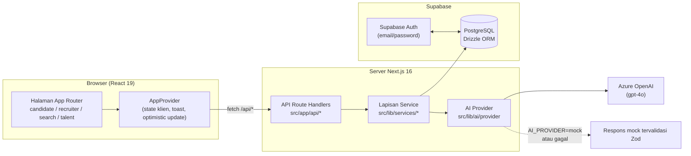
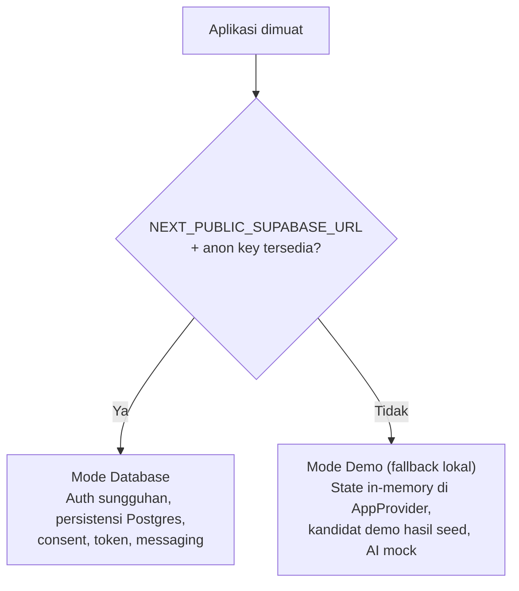
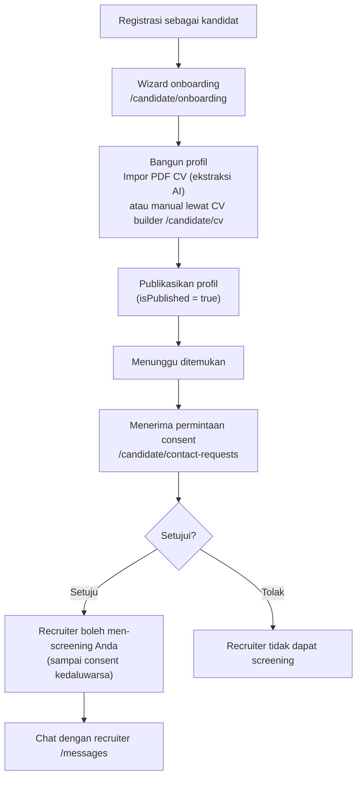
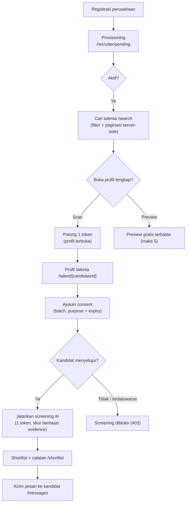
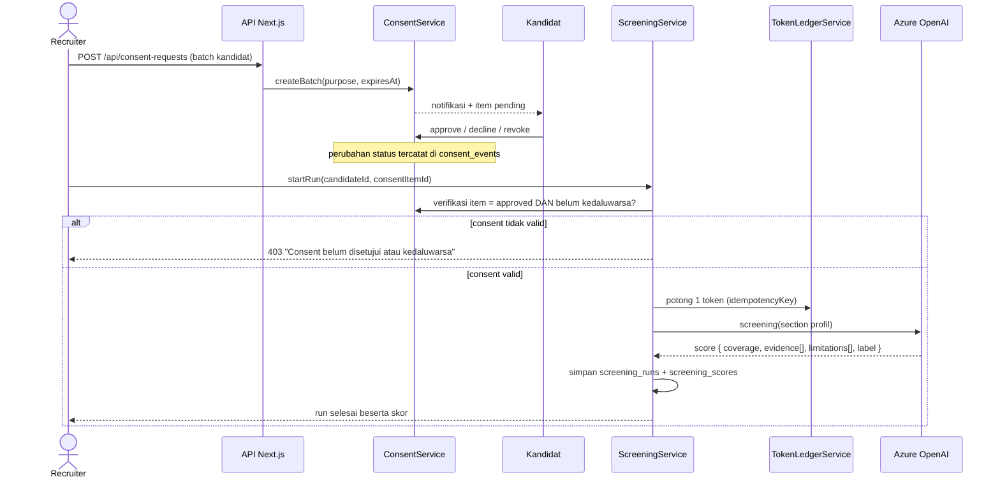
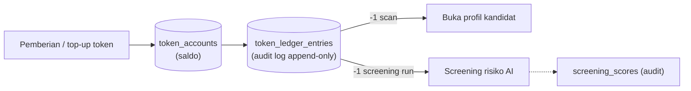
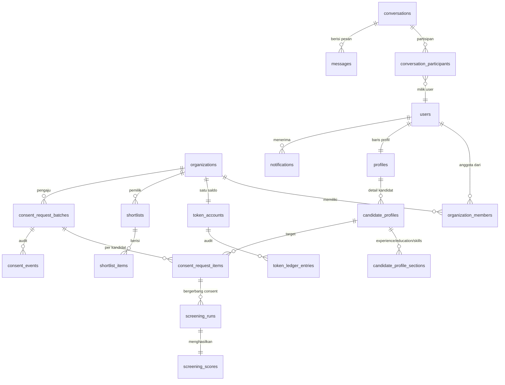

# ProofyLink Talent Network — Panduan Arsitektur & Alur

Dokumen ini menjelaskan apa yang dilakukan layanan ini, bagaimana data mengalir, dan di mana setiap bagian berada di dalam kodebase. Diagram menggunakan [Mermaid](https://mermaid.js.org/) dan dirender langsung di GitHub.

> **Catatan pratinjau lokal:** GitHub merender Mermaid secara bawaan. Jika Anda memakai VS Code, pasang ekstensi **"Markdown Preview Mermaid Support"** agar diagram tampil di preview.

---

## 1. Apa yang dilakukan layanan ini?

ProofyLink menghubungkan **kandidat** dan **recruiter** melalui pipeline screening yang berbasis persetujuan (consent-first):

- **Kandidat** membangun profil terstruktur (impor CV, skill, pengalaman), mempublikasikannya, dan mengontrol siapa yang boleh men-screening mereka melalui **permintaan consent** yang eksplisit.
- **Recruiter** mencari talenta yang sudah dipublikasikan, memakai **token** untuk membuka profil lengkap, mengirim permintaan consent, menjalankan **screening risiko/kredibilitas berbasis AI**, melakukan shortlist, dan mengirim pesan.
- Setiap screening menghasilkan **skor** yang dapat diaudit (coverage, evidence, limitations) yang tersimpan di database — bukan sekadar jawaban AI tanpa jejak.

Prinsip intinya: **tidak ada screening tanpa consent kandidat, tidak ada aksi tanpa jejak token.**

---

## 2. Arsitektur Sistem



**Aturan utama:** semua akses database melewati lapisan service (`src/lib/services/`) — halaman tidak pernah query Drizzle secara langsung. Setiap service memiliki satu domain:

| Service | Domain |
| :--- | :--- |
| `TalentSearchService` | Pencarian talenta level database, filter, paginasi |
| `ProfileService` | Persistensi profil & section kandidat |
| `ShortlistService` | Shortlist + item (termasuk provisioning shortlist default) |
| `ConsentService` | Batch consent, item, event, kedaluwarsa |
| `ScreeningService` | Cek consent → pemotongan token → run AI → penyimpanan skor |
| `MessagingService` | Percakapan, partisipan, pesan (menghindari N+1) |
| `TokenLedgerService` | Saldo token + entri ledger append-only |

---

## 3. Operasi Dual-Mode

Aplikasi berjalan dalam dua mode bergantung pada keberadaan env var Supabase:



- **Mode database**: registrasi melakukan provisioning user → organization/member → token account; profil tersinkron ke `profiles` + `candidate_profile_sections`; setiap mutasi melewati `/api/*`.
- **Mode demo**: `src/lib/demo-seed.ts` menyediakan data agar produk tetap bisa diklik penuh untuk review desain tanpa backend apa pun.
- ID recruiter berbentuk UUID diarahkan ke alur database; ID non-UUID (seed demo) tetap lokal — lihat `UUID_RE` di `src/lib/utils.ts`.

---

## 4. Perjalanan Pengguna

### Perjalanan kandidat



### Perjalanan recruiter



---

## 5. Alur Inti: Screening Bergerbang Consent

Ini adalah jantung produk — bagaimana recruiter berpindah dari *menemukan kandidat* menjadi *memiliki laporan screening*:



Status consent (`src/types/index.ts`):

```
not-requested → pending-candidate-consent → consented ─→ withdrawn
                                          ├→ declined
                                          └→ consent-expired
consented → screening-in-progress → screening-completed → disputed
```

Sebuah batch bisa membawa `expiresAt` sendiri; consent yang kedaluwarsa gagal di jalur 403 yang sama dengan consent yang ditolak.

---

## 6. Ekonomi Token

Token bersifat per-organisasi dan berbasis ledger:



- Saldo hidup di `token_accounts`; **setiap** perubahan menulis baris `token_ledger_entries` (source, amount, idempotency key).
- Idempotency key membuat retry aman — mengulang grant atau screening tidak pernah memotong ganda.
- Route top-up khusus dev: `POST /api/dev/token-grant` (butuh `DEV_TOKEN_GRANT_ENABLED=true` + mode development).
- Preview gratis: recruiter dapat melihat sejumlah profil terbatas (5) sebelum wajib scan/screening.

---

## 7. Model Data (disederhanakan)



Skema lengkap: `src/db/schema.ts`. Migrations dikomit — generate dengan `npm run db:generate`, apply dengan `npm run db:migrate`, jangan pernah `drizzle push`.

---

## 8. Lapisan AI

`src/lib/ai/provider.ts` membungkus Vercel AI SDK:

- Provider dipilih lewat `AI_PROVIDER` (`azure` | `mock`).
- Azure OpenAI (`gpt-4o`) dipakai untuk:
  - **Ekstraksi PDF CV** → draft profil terstruktur (`POST /api/cv/import`)
  - **Run screening** → skor coverage, daftar evidence, limitations, label risiko
  - **Saran career advisor / roadmap** di sisi kandidat
- Semua output AI diparse melalui **skema Zod**; jika provider `mock`, kredensial hilang, atau panggilan gagal, respons mock terstruktur dikembalikan — sehingga tidak ada alur UI yang keras kepala bergantung pada LLM yang selalu hidup.

---

## 9. Di Mana Segala Sesuatu Berada

| Path | Fungsi |
| :--- | :--- |
| `src/app/(pages)` | Route: `candidate/`, `recruiter/`, `search/`, `talent/[candidateId]/`, `shortlist/`, `messages/`, `partner/` |
| `src/app/api/` | Route handlers: `candidates/`, `consent-requests/`, `screening-runs/`, `shortlists/`, `tokens/`, `messages/`, `conversations/`, `cv/`, `profile/`, `notifications/`, `dev/` |
| `src/lib/services/` | Satu class per domain (lihat tabel di §2) |
| `src/lib/ai/` | Abstraksi provider + skema Zod |
| `src/providers/app-provider.tsx` | Store sisi klien: sesi, toast, shortlist/catatan optimistis, fallback demo |
| `src/db/` | Skema Drizzle + client |
| `scripts/tests/` | Script E2E lintas-akun (`npm run test:e2e`) |

---

*Ada pertanyaan tentang alur tertentu? Cek class service-nya lebih dulu — di sanalah sumber kebenaran aturan bisnis.*
