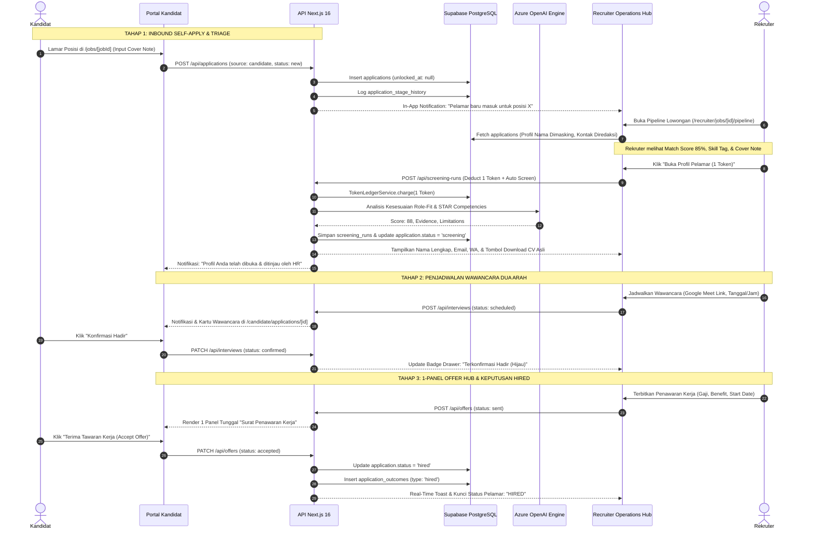

# PRD & Arsitektur Sistem: Siklus Rekrutmen End-to-End, Monetisasi Inbound Triage, & Unifikasi Dover Pipeline
**ProofyLink Talent Network (Djoin)**  
*Dokumen Spesifikasi Produk & Arsitektur Sistem (Versi 2.4 - September 2026)*  
*Target Handover: Engineering, Product, UI/UX, & Business Operations*

---

## I. Ringkasan Eksekutif & Latar Belakang Masalah

Platform **ProofyLink Talent Network** bertransformasi menjadi *Talent Intelligence & HR Risk Screening Platform* yang menghubungkan talenta profesional terverifikasi (*candidates*) dengan perusahaan (*recruiters*).

Model bisnis platform berpusat pada **Sistem Token Terdesentralisasi (Token Economy)**:
- **Paket Token Perusahaan**: Starter (Rp49.889/token), Growth (Rp44.889/token), Professional (Rp34.889/token), Enterprise (Rp29.889/token).
- **Utilisasi Token**:
  - `1 Token`: Membuka Profil Penuh Kandidat (*Talent Unlock*) — membuka nama lengkap, email, nomor WhatsApp, unduhan CV asli, tautan LinkedIn, serta portofolio.
  - `1 Token`: Menjalankan AI Risk/Role-Fit Screening (*Deep Screening Run*) — menghasilkan skor kesesuaian, audit coverage, bukti kompetensi, dan limitasi data.

### Identifikasi Flaw Kritis pada Sistem Eksisting:

1. **Kebocoran Model Bisnis & Dilema Self-Apply (The Inbound Paradox)**:
   - **Flaw di Kode**: Pada `src/components/recruiter/recruiter-operations.tsx` (baris 559), data pelamar difilter ketat dengan `scannedCandidateIds.has(app.candidateProfileId)`. Akibatnya, kandidat yang melamar sendiri (*self-apply*) **hilang sepenuhnya** dari papan Kanban rekruter karena belum pernah di-unlock!
   - **Penyelesaian Semu di Backend**: Pada `src/app/api/app/bootstrap/route.ts` (baris 121-131), semua `applications` secara otomatis dimasukkan ke dalam `scannedCandidateIds`. Hal ini menyebabkan **kebocoran pendapatan fatal**: perusahaan dapat memposting lowongan, menerima ratusan pelamar, dan mendapatkan kontak serta CV gratis tanpa pernah mengonsumsi token!
2. **Pipeline Lowongan yang Outdated & Terdegradasi**:
   - Halaman `/recruiter/jobs/[jobId]/pipeline` masih menggunakan komponen purba `RecruiterPipelinePage` dari `application-ui.tsx` (tiga kolom sederhana dengan dropdown select box HTML statis).
   - Terjadi disparitas drastis dengan `/recruiter/operations` yang sudah mengadopsi standar **Dover ATS** (Kanban interaktif, SLA Aging, laci profil kandidat, penjadwalan interview dua arah, serta hub penawaran interaktif).
3. **Komunikasi Kandidat-Rekruter yang Terfragmentasi**:
   - Aturan pada `inbox-messaging-guideline.md` masih mengacu pada sistem *bilateral consent pop-up* yang sudah dihapus sejak 20 September 2026 (*Open to Work opt-in*).
   - Belum ada batasan tegas mengenai kapan rekruter diizinkan mengirim pesan atau mengundang wawancara kepada pelamar inbound (harus berpagar *profile unlock*).

---

## II. Solusi Desain Sistem: Masked Inbound Triage & Dover Unification

Untuk memecahkan paradoks di atas tanpa merusak pengalaman pengguna dan tetap mempertahankan monetisasi token, diterapkan arsitektur **Masked Inbound Triage**:

```
               [ Kandidat Melamar Mandiri (Self-Apply) ]
                                 │
                                 ▼
                     Status: 'new' (Inbound)
                                 │
       ┌─────────────────────────┴─────────────────────────┐
       ▼                                                   ▼
[ Triage Gratis (0 Token) ]                   [ Buka Profil & Tinjau (1 Token) ]
• Nama Ter-masking (N**** P*** R*****)        • Potong 1 Token dari Akun Perusahaan
• AI Skill Match Preview (85% Fit)            • Status Otomatis Pindah ke 'screening'
• Ringkasan Pengalaman & Pendidikan           • AI Role-Fit Screening Dieksekusi
• Cover Note Pelamar Lengkap                  • Buka Kontak (Email, WhatsApp, LinkedIn)
• Tombol "Tolak Lamaran" (GRATIS)             • Buka Unduhan Berkas CV PDF Asli
  (HR tidak boros token untuk spam)           • Buka Fitur Chat & Jadwal Wawancara
```

### 1. Prinsip Utama Alur Ganda (Dual-Path Sourcing)
- **Jalur Outbound (Talent Search / Headhunting)**:
  - Rekruter mencari kandidat di `/search` atau `/recruiter/discover`.
  - Profil awal ter-masking. Rekruter menekan `Buka Profil · 1 Token`.
  - Setelah terbuka, kandidat dapat dimasukkan ke *Talent Pool* atau ditugaskan langsung ke lowongan aktif.
- **Jalur Inbound (Kandidat Melamar ke Lowongan)**:
  - Kandidat membuka `/jobs/[jobId]` dan mengirimkan formulir lamaran (`POST /api/applications`).
  - Berkas lamaran masuk ke lowongan dengan status `new` dan `source: 'candidate'`.
  - Rekruter melihat kartu pelamar di kolom **Baru / Inbound** dalam mode *Masked Triage*.
  - Rekruter dapat menolak pelamar yang tidak relevan secara **GRATIS (0 Token)**.
  - Rekruter membayar **1 Token** untuk membuka profil lengkap pelamar, yang secara otomatis memindahkan status ke **Peninjauan Berkas (Screening)** dan menjalankan analisis AI Role-Fit.

### 2. Unifikasi Halaman Pipeline Lowongan
- Halaman `/recruiter/jobs/[jobId]/pipeline` diremajakan secara total dengan menghubungkan langsung ke engine `RecruiterOperations` dengan filter `jobId` terpasang secara otomatis.
- Rekruter mendapatkan antarmuka yang konsisten: Kanban board modern, Laci Detail Kandidat (*Candidate Drawer*), Penjadwal Wawancara (Google Meet/Zoom), Hub Penawaran Kerja 1-Panel, dan Pelacak SLA Aging.

---

## III. Diagram Alur & Arsitektur Visual (Mermaid)

### 1. Data Flow Diagram (DFD Level 1 — Rekrutmen & Monetisasi Token)

```mermaid
graph TD
    Cand[Kandidat] -->|1. Submit Lamaran + Cover Note| API_App[API /api/applications]
    API_App -->|2. Simpan Lamaran Baru| DB_App[(Supabase: applications)]
    API_App -->|3. Trigger Notifikasi| NotifSvc[Notification Service]
    NotifSvc -->|4. Push Notifikasi Masuk| Rec[Rekruter]

    Rec -->|5. Tinjau Kartu Pelamar Ter-masking| UI_Ops[Recruiter Operations Hub]
    UI_Ops -->|Query Data Lowongan| API_App
    
    alt Skenario A: Pelamar Tidak Sesuai (Tolak Gratis)
        Rec -->|Klik Tolak Lamaran| UI_Ops
        UI_Ops -->|PATCH status: rejected (0 Token)| API_App
        API_App -->|Update Status & Stage History| DB_App
    else Skenario B: Pelamar Potensial (Unlock 1 Token)
        Rec -->|Klik Buka Profil Pelamar| UI_Ops
        UI_Ops -->|POST /api/tokens/unlock-candidate| TokenSvc[Token Ledger Service]
        TokenSvc -->|Cek Saldo & Potong 1 Token| DB_Token[(Supabase: token_ledger_entries)]
        TokenSvc -->|Update Status ke 'screening'| DB_App
        TokenSvc -->|Trigger Analisis Role-Fit| AISvc[AI Screening Engine]
        AISvc -->|Simpan Skor & Bukti| DB_Screen[(Supabase: screening_runs)]
        TokenSvc -->|Unmask Data Kontak & CV PDF| UI_Ops
    end

    UI_Ops -->|6. Jadwalkan Wawancara| API_IV[API /api/interviews]
    API_IV -->|7. Sinkronisasi Jadwal 2 Arah| Cand
    Cand -->|8. Konfirmasi / Reschedule| API_IV
    
    UI_Ops -->|9. Terbitkan Surat Penawaran v1| API_Offer[API /api/offers]
    API_Offer -->|10. Tinjau Penawaran 1-Panel| Cand
    Cand -->|11. Klik Terima Penawaran (Accept)| API_Offer
    API_Offer -->|12. Kunci Status HIRED| DB_App
```

### 2. Sequence Diagram: Alur Inbound Pelamar hingga Diterima Bekerja



---

## IV. Spesifikasi Fungsional Peran Pengguna (PRD)

### 1. Modul Rekruter (Recruiter Operations Hub)

| Fitur | Deskripsi Fungsional | Aturan Akses & Bisnis |
| :--- | :--- | :--- |
| **Masked Inbound Card** | Menampilkan kartu pelamar masuk di kolom `new` dengan nama inisial (`N**** P*** R*****`), ringkasan skill, dan cover note. | Informasi privat (email, WA, PDF CV) terkunci sampai token dipotong. |
| **Tolak Tanpa Biaya (Free Reject)** | Tombol "Tolak" langsung pada kartu pelamar inbound. | Gratis (0 token). Memindahkan status ke `rejected` dan mengirim notifikasi penolakan sopan. |
| **Buka Profil (Unlock Token)** | Tombol aksi utama "Buka Profil & Tinjau (1 Token)". | Memotong 1 token. Memindahkan status ke `screening`, menjalankan AI role-fit, dan membuka data kontak serta akses download CV. |
| **Unified Job Pipeline** | Rute `/recruiter/jobs/[jobId]/pipeline` menggunakan komponen `RecruiterOperations` yang langsung ter-filter ke lowongan tersebut. | Dilengkapi drawer detail kandidat, SLA Aging, dan aksi batch. |
| **Interview Scheduler** | Menjadwalkan sesi wawancara lengkap dengan link Google Meet/Zoom, zona waktu, durasi, dan panel scorecard. | Mendukung respon dua arah kandidat: Konfirmasi, Reschedule, dan Tolak Sesi. |
| **Interactive Offer Hub** | Formulir penerbitan surat penawaran kerja (gaji, benefit, tanggal mulai, tanggal kedaluwarsa). | Mendukung penerbitan revisi (v1, v2) berdasarkan aspirasi negosiasi kandidat. |

### 2. Modul Kandidat (Candidate Portal)

| Fitur | Deskripsi Fungsional | Tampilan Antarmuka |
| :--- | :--- | :--- |
| **Formulir Self-Apply** | Melamar posisi di `/jobs/[jobId]` dengan cover note terstruktur. | Profil dan CV ATS tersimpan otomatis dilampirkan. |
| **4-Milestone Tracker** | Pelacak proses lamaran transparan di `/candidate/applications/[applicationId]`. | 1. Peninjauan Berkas, 2. Asesmen & Skrining, 3. Wawancara, 4. Keputusan Akhir. |
| **Interaksi Wawancara** | Tombol aksi: `[Konfirmasi Hadir]`, `[Ajukan Reschedule]`, dan `[Tolak Sesi Ini]` serta unduh kalender `.ics`. | Pengajuan ganti jam otomatis memperbarui kalender rekruter tanpa menggugurkan lamaran. |
| **1-Panel Offer Hub** | Tampilan surat penawaran tunggal bebas tumpukan kartu lama. | Menampilkan gaji bulanan, fasilitas, countdown kedaluwarsa, tombol `Terima Tawaran`, dan dialog negosiasi bebas. |

---

## V. Dampak & Tata Kelola Infrastruktur Cloud

### 1. Supabase (Database, Storage, & RLS)
- **Modifikasi Skema Database (`src/db/schema.ts`)**:
  - Menambahkan kolom `unlockedAt` pada tabel `applications`:
    ```typescript
    unlockedAt: timestamp("unlocked_at", { withTimezone: true })
    ```
  - Indeks database:
    ```typescript
    index("applications_job_unlocked_idx").on(table.jobId, table.unlockedAt)
    ```
  - Prosedur migrasi: Jalankan `npm run db:generate` lalu `npm run db:migrate`. Verifikasi dengan `npm run db:check`. Dilarang keras menjalankan `drizzle push`.
- **Koreksi API Bootstrap (`src/app/api/app/bootstrap/route.ts`)**:
  - Hapus penambahan otomatis seluruh `applications` ke `scannedCandidateIds`.
  - Hanya masukkan kandidat yang memiliki `screening_runs` berstatus `completed`/`approved` ATAU `applications` dengan `unlockedAt IS NOT NULL`.
- **Supabase Storage Bucket**:
  - Pastikan `.env.local` memiliki konfigurasi bucket CV yang valid:
    ```env
    SUPABASE_CV_BUCKET=cv-documents
    SUPABASE_PROFILE_MEDIA_BUCKET=profile-media
    SUPABASE_MESSAGE_BUCKET=message-attachments
    DOCUMENT_STORAGE_ENABLED=true
    ```
  - Konfigurasi RLS: Berkas pada `cv-documents` hanya dapat diunduh oleh pemilik akun kandidat dan rekruter dari organisasi yang telah meng-unlock profil tersebut.

### 2. Vercel (Edge & Production Runtime)
- **Next.js 16 App Router Compatibility**:
  - Parameter rute dinamis pada Next.js 16 adalah asynchronous (`params: Promise<{ jobId: string }>`).
  - Halaman `/recruiter/jobs/[jobId]/pipeline/page.tsx` wajib meng-await params sebelum merender komponen pipeline.
- **Environment Variables**:
  - Pastikan seluruh variabel lingkungan (`NEXT_PUBLIC_SUPABASE_URL`, `DATABASE_URL`, `AZURE_OPENAI_*`, `BILLING_ENABLED`) terdaftar pada *Vercel Project Settings*.
- **Build Guarantee**:
  - Eksekusi `npm run lint`, `npx tsc --noEmit`, dan `npm run build` sebelum perubahan di-deploy ke production.

---

## VI. Panduan Operasional & Tutorial Penggunaan (Handover Guide)

### Tutorial untuk Rekruter:

1. **Menerima & Meninjau Pelamar Baru**:
   - Buka menu **Jobs** di navbar atau dashboard rekruter.
   - Pilih lowongan yang diinginkan dan klik **"Lihat Pipeline"** (membuka `/recruiter/jobs/[jobId]/pipeline`).
   - Pelamar baru akan berada di kolom **Baru / Inbound** dengan nama ter-masking.
   - Evaluasi kesesuaian awal melalui persentase Match Score, daftar keahlian, dan pesan pembuka (*cover note*).
2. **Menolak Pelamar Spam / Tidak Sesuai (Gratis)**:
   - Jika pelamar tidak memenuhi kualifikasi, klik tombol **"Tolak"** pada kartu.
   - Saldo token organisasi Anda **TIDAK berkurang** (0 Token).
3. **Membuka Profil Pelamar Potensial (1 Token)**:
   - Jika pelamar menarik, klik tombol **"Buka Profil & Tinjau"**.
   - Muncul dialog konfirmasi pemotongan 1 Token. Klik **"Konfirmasi Buka Profil"**.
   - Sistem seketika memotong 1 Token, memindahkan pelamar ke kolom **Peninjauan Berkas (Screening)**, dan mengeksekusi AI Role-Fit.
   - Seluruh kontak (email, WhatsApp, LinkedIn) dan tombol **"Unduh CV Asli"** kini terbuka penuh.
4. **Menjadwalkan Wawancara**:
   - Klik kartu pelamar untuk membuka **Candidate Detail Drawer**.
   - Pilih tab **Jadwal Wawancara** -> Masukkan tanggal, jam WIB, dan tautan Google Meet / Zoom -> Klik **"Kirim Jadwal Wawancara"**.
   - Pantau status respon kandidat (Terkonfirmasi Hadir / Permintaan Reschedule).
5. **Menerbitkan Penawaran Kerja hingga Hired**:
   - Pindahkan kandidat ke kolom **Penawaran Kerja (Offer)**.
   - Buka tab **Surat Penawaran** pada laci -> Isi gaji pokok, tunjangan, dan tanggal mulai kerja -> Klik **"Terbitkan Surat Penawaran"**.
   - Begitu kandidat menyetujui di portalnya, status kandidat otomatis berubah menjadi **Hired (Diterima)**.

### Tutorial untuk Kandidat:

1. **Melamar Pekerjaan**:
   - Buka katalog lowongan di `/jobs`.
   - Pilih posisi yang sesuai dan klik **"Lamar Posisi Ini"**.
   - Tulis *cover note* singkat (minimal 20 karakter) dan klik **"Kirim Lamaran Sekarang"**.
2. **Memantau Status di Portal Aplikasi**:
   - Buka menu **Aplikasi Saya** (`/candidate/applications`).
   - Klik rincian lamaran untuk melihat **4-Milestone Tracker**:
     - *Peninjauan Berkas*: Lamaran sedang ditinjau tim HR.
     - *Asesmen & Skrining*: Profil telah dibuka dan dievaluasi.
     - *Wawancara*: Undangan wawancara masuk.
     - *Keputusan Akhir*: Penawaran kerja terbit atau selesai.
3. **Merespon Jadwal Wawancara**:
   - Jika jadwal cocok, klik **"Konfirmasi Hadir"** dan klik **"Unduh Kalender (.ics)"**.
   - Jika bentrok, klik **"Ajukan Reschedule"**, pilih tanggal/jam baru serta tuliskan alasan ringkas.
4. **Menerima Surat Penawaran Kerja**:
   - Pada tahap penawaran, tinjau kompensasi dan fasilitas pada panel surat penawaran.
   - Jika ingin berdiskusi, klik **"Beri Pesan / Ajukan Diskusi"** untuk menyampaikan aspirasi.
   - Jika sepakat, klik **"Terima Tawaran Kerja (Accept Offer)"**. Anda resmi diterima (*Hired*)!

---

## VII. Rencana Eksekusi Berfase & QA Verification Plan

Sesuai SOP proyek, implementasi wajib dilakukan dalam fase-fase granular dengan satu commit Git per fase:

| Fase | Cakupan Implementasi | Validasi QA Mandatori |
| :--- | :--- | :--- |
| **Fase 1: Database & Migration** | Tambah `unlockedAt` pada tabel `applications` di `schema.ts`. Eksekusi `npm run db:generate` & `npm run db:migrate`. | `npm run db:check`, verifikasi skema Supabase. |
| **Fase 2: Backend API & Service** | Update `bootstrap/route.ts` (cabut auto-unlock cheat), buat endpoint unlock pelamar inbound di `/api/screening-runs` atau `/api/applications/[id]/unlock`. | Uji unit endpoint, verifikasi saldo token berkurang tepat 1 dengan ledger entry. |
| **Fase 3: Unifikasi Pipeline Lowongan** | Update `/recruiter/jobs/[jobId]/pipeline/page.tsx` untuk menggunakan `RecruiterOperations` dengan `initialJobId={jobId}` dan dukungan kartu masked triage. | Verifikasi tampilan kanban lowongan, filter otomatis, dan laci kandidat. |
| **Fase 4: Masked Triage UI & Aksi** | Implementasi kartu pelamar inbound ter-masking di Kanban board dan tombol "Buka Profil (1 Token)" serta "Tolak (0 Token)". | Verifikasi penolakan gratis 0 token & pembukaan profil memotong 1 token. |
| **Fase 5: Verifikasi QA End-to-End** | Jalankan pengujian lintas akun (`adriennedeveloper@gmail.com` dan `lie.adriennekayana@gmail.com`) via Playwright script. | `npm run lint`, `npx tsc --noEmit`, `npm run build`, E2E test pass 100%. |

---

*Dokumen ini merupakan acuan resmi pengembangan dan serah terima teknis platform ProofyLink Talent Network.*
