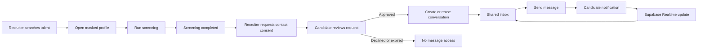

# Inbox Messaging Guideline

## Purpose

The inbox is a consent-first communication channel between a recruiter and a candidate **after a screening has finished**. Screening and messaging are separate permissions:

- Screening gives the recruiter a role-fit result and, when permitted, unlocks profile context.
- Messaging starts only after the candidate approves a contact request.
- A completed screening must never silently create permission to contact a candidate.

This preserves the product promise of privacy by default and prevents recruiter outreach from becoming unsolicited spam.

## Product Flow



### Happy path

1. Recruiter signs in and reaches an active recruiter dashboard.
2. Recruiter searches by role or skill, for example `Python`, `React`, or `TypeScript`.
3. Recruiter opens a masked candidate profile.
4. Recruiter confirms `Buka Profil · 1 Token`.
5. The platform creates a screening run, charges one token, executes the AI screening result, and displays the score, evidence, limitations, and AI draft summary.
6. Recruiter clicks `Minta izin menghubungi` or equivalent contact-consent action.
7. Candidate sees the request at `/candidate/contact-requests`.
8. Candidate approves the request.
9. Recruiter creates or reopens the conversation from the unlocked profile.
10. Both users access the same conversation from `/messages`.
11. Recruiter sends an opening message with context from the screening, without treating the AI score as an automatic hiring decision.
12. Candidate receives an in-app notification and sees the message in real time when the inbox is open.

## Authorization Policy

### Recruiter

Recruiters may:

- View published candidate previews.
- Run screening only when their organization is active and has sufficient tokens.
- Create a contact-consent request for a candidate.
- Create a conversation only when that candidate has an approved consent item for the recruiter organization.
- Read and send messages only in conversations where they are an active participant.
- Edit or soft-delete their own messages.
- Block or unblock a conversation according to the existing conversation policy.

Recruiters may not:

- Create a conversation merely because screening completed.
- Read another organization's conversations.
- Send messages to a candidate who declined, revoked, or let consent expire.
- use the AI score as an automatic hire/reject decision.

### Candidate

Candidates may:

- View incoming consent requests.
- Approve, decline, or revoke contact consent according to the consent lifecycle.
- Read and send messages only in conversations where they are an active participant.
- Report a message.
- Block a conversation when communication should stop.

## Existing Project Tools

The MVP should use the existing project stack. Do not add Pusher, Ably, Stream, Socket.IO, or a separate chat vendor for this phase.

| Responsibility | Existing tool | Project location |
| --- | --- | --- |
| Authentication and session cookies | Supabase Auth + `@supabase/ssr` | `src/lib/supabase/*` |
| Server routes | Next.js 16 App Router route handlers | `src/app/api/*` |
| Data access | Drizzle ORM over Supabase Postgres | `src/db/*` |
| Consent workflow | `ConsentService` | `src/lib/services/consent.ts` |
| Screening and token charge | `ScreeningService` + `TokenLedgerService` | `src/lib/services/screening.ts`, `token-ledger.ts` |
| Conversation and message rules | `MessagingService` | `src/lib/services/messaging.ts` |
| Live message delivery | Supabase Realtime `postgres_changes` | `src/app/messages/page.tsx` |
| In-app notifications | `notifications` table | `MessagingService.sendMessage` |
| Audit trail | `audit_logs` through `writeAuditLog` | `src/lib/audit.ts` |
| Input validation | Zod | API route handlers |
| Abuse protection | Existing rate limiter | `src/lib/api/rate-limit.ts` |
| Browser verification | Playwright CLI and Playwright Test | `e2e/*`, `.agents/skills/playwright-cli` |

### Optional later tools

- Supabase Storage for attachments, using private buckets and signed URLs.
- Brevo or an Edge Function for email notifications when a user is offline.
- TanStack Query for cache and retry behavior if inbox traffic becomes complex.
- A virtualized list such as `react-virtuoso` only after message volume requires it.

These are not required for the first working inbox.

## API Contract

### Consent

Existing routes:

```text
POST  /api/consent-requests
GET   /api/consent-requests
PATCH /api/consent-requests/[itemId]
```

Recruiter request:

```json
{
  "candidateProfileIds": ["candidate-profile-uuid"],
  "purpose": "Diskusi peluang Software Engineer setelah screening",
  "message": "Kami ingin mendiskusikan hasil screening dan peluang yang relevan."
}
```

Candidate decision:

```json
{
  "decision": "approved"
}
```

Valid decisions are `approved` and `declined`. Revocation and expiry must prevent new conversations or new messages according to the consent policy.

### Conversations

Existing routes:

```text
GET  /api/conversations?limit=100
POST /api/conversations
PATCH /api/conversations/[conversationId]
```

Create or reuse a conversation:

```json
{
  "candidateProfileId": "candidate-profile-uuid"
}
```

Expected outcomes:

- `201`: new conversation created.
- `200`: existing active conversation reused.
- `403`: consent is not approved or recruiter scope is invalid.
- `409`: conversation is no longer active where applicable.

The `POST /api/conversations` route must remain the authoritative consent gate. The client should show a useful next action when it receives `403`, such as `Minta persetujuan kandidat terlebih dahulu`.

### Messages

Existing routes:

```text
GET    /api/messages?conversationId=<uuid>&cursor=<cursor>&limit=30
POST   /api/messages
PATCH  /api/messages/[messageId]
DELETE /api/messages/[messageId]
POST   /api/messages/[messageId]       # report
```

Send message:

```json
{
  "conversationId": "conversation-uuid",
  "body": "Halo, kami tertarik mendiskusikan pengalaman Anda di Python dan backend engineering."
}
```

Message rules:

- Trim and require a non-empty body.
- Maximum body length is 4,000 characters.
- Verify active conversation participation on every read and write.
- Rate-limit sends per authenticated user.
- Insert the message, update conversation activity, create recipient notification, and write the audit event in one transaction.
- Use soft delete so audit history remains consistent.

## Inbox UI Requirements

### Shared inbox

The recruiter and candidate should use the same message surface with role-specific entry points:

- Recruiter entry: `/recruiter/messages` or `/messages`.
- Candidate entry: `/candidate/messages` or `/messages`.
- Conversation deep link: `/messages?conversationId=<uuid>`.

Required UI states:

- Loading conversation list.
- Empty inbox.
- Empty selected conversation.
- Loading older messages.
- Sending message.
- Message send failure with retry guidance.
- Consent-required error.
- Blocked conversation.
- Candidate unavailable or consent expired.
- Offline or Realtime reconnect state.

Required controls:

- Conversation list with participant name, latest message, and updated time.
- Message bubbles with sender ownership and timestamps.
- `Muat pesan sebelumnya` when a cursor page exists.
- Composer with `Enter` to send and `Shift+Enter` for a newline.
- Edit and delete controls for the current user's messages.
- Report control for messages from the other participant.
- Block/unblock control for the conversation.
- Clear accessible names: `Isi pesan`, `Kirim pesan`, `Muat pesan sebelumnya`.

### Recruiter screening context

The first recruiter message should be contextual, but the UI must not automatically send AI-generated text without explicit recruiter action. Recommended composer helpers:

- `Perkenalkan diri dan perusahaan`
- `Bahas skill yang relevan`
- `Tanyakan ketersediaan diskusi`

Any AI-assisted draft must be labeled `AI draft`, editable before sending, and include a reminder that screening is not an automatic hiring decision.

## Realtime Design

Use Supabase Realtime for `INSERT` events on `public.messages`, filtered by `conversation_id`.

Rules:

- Compare `messages.sender_id` with the authenticated app user's UUID, not their email.
- Deduplicate by message ID because the sender receives the persisted response and may also receive a Realtime event.
- Remove the channel when the conversation changes or the component unmounts.
- Re-fetch the current conversation after reconnecting if the channel reports an error.
- Realtime is an enhancement; the REST message list remains the source of truth.

Optional later events:

- `broadcast` for typing indicators.
- Presence for online state.
- Read receipts through the existing conversation participant read timestamp.

## Database and Security Checklist

The existing MVP tables are:

- `conversations`
- `conversation_participants`
- `messages`
- `notifications`
- `message_reports`
- `audit_logs`
- `consent_request_batches`
- `consent_request_items`

Before production:

1. Confirm RLS is enabled on every exposed messaging and reporting table.
2. Add policies based on conversation participation and organization scope; `TO authenticated` alone is not sufficient.
3. Keep authorization based on server-side `public.users` and membership rows, never editable `user_metadata`.
4. Add or verify indexes for:
   - `messages (conversation_id, created_at DESC, id DESC)`
   - `conversation_participants (user_id, conversation_id)`
   - `notifications (user_id, created_at DESC)`
5. Keep message body and participant authorization checks in the service layer.
6. Run Supabase security and performance advisors after any schema change.

## Known Current Gaps

These are the issues found during the live walkthrough:

- Screening completed successfully, but `POST /api/conversations` returned `403` without approved candidate consent. This is expected policy behavior but needs a visible client action to request consent.
- The profile page currently says `Mulai percakapan` immediately after screening, although messaging still requires consent. Rename or replace this action with `Minta izin menghubungi` when consent is absent.
- The Realtime callback previously compared `senderId` to the user's email. It must compare UUID to UUID.
- The inbox had message action functions but did not expose all of them through visible controls.
- Older-message pagination state existed but had no visible load-more control.
- The current UI has attachment state/types, but attachment upload and private Storage authorization are not yet part of the MVP contract.

## Acceptance Tests

### Recruiter flow

1. Sign in as an active recruiter.
2. Open `/search` and search `Python`.
3. Open a candidate detail route.
4. Confirm unlock and assert a completed screening result with score, evidence, limitations, and AI draft disclosure.
5. Click contact action while consent is absent.
6. Assert the UI explains that candidate approval is required and does not create a conversation.
7. Create a consent request.

### Candidate flow

1. Sign in as the candidate.
2. Open `/candidate/contact-requests`.
3. Approve the request.
4. Assert the approved state is persisted.

### Messaging flow

1. Return to recruiter session.
2. Create or reuse a conversation.
3. Open `/messages?conversationId=<uuid>`.
4. Send a message and assert `POST /api/messages` returns `201`.
5. Assert the message appears once in the recruiter inbox.
6. Open the same conversation as the candidate and assert the message is visible.
7. Send a candidate reply and assert it appears in the recruiter inbox through Realtime or a REST refresh.
8. Verify edit, soft delete, report, block, and pagination behavior.

### Negative tests

- Anonymous user cannot list conversations or messages.
- A recruiter without active organization membership receives `401` or `403`.
- A recruiter without approved consent cannot create a conversation.
- A non-participant cannot read or send in a conversation.
- A blocked conversation rejects new messages with `409`.
- Empty or overlong messages receive `400`.
- Excessive sends receive `429`.

## Implementation Order

1. Align the profile contact CTA with consent state.
2. Expose the consent-request action and candidate approval path.
3. Finish inbox controls, pagination, and message states.
4. Verify Supabase Realtime UUID handling and reconnect behavior.
5. Add Playwright coverage for the two-account recruiter/candidate flow.
6. Add indexes and RLS policies before enabling attachments or production notifications.

The first production-ready milestone is a text-only, consent-gated inbox. Attachments, typing indicators, presence, email, and push notifications should follow as separate milestones.
